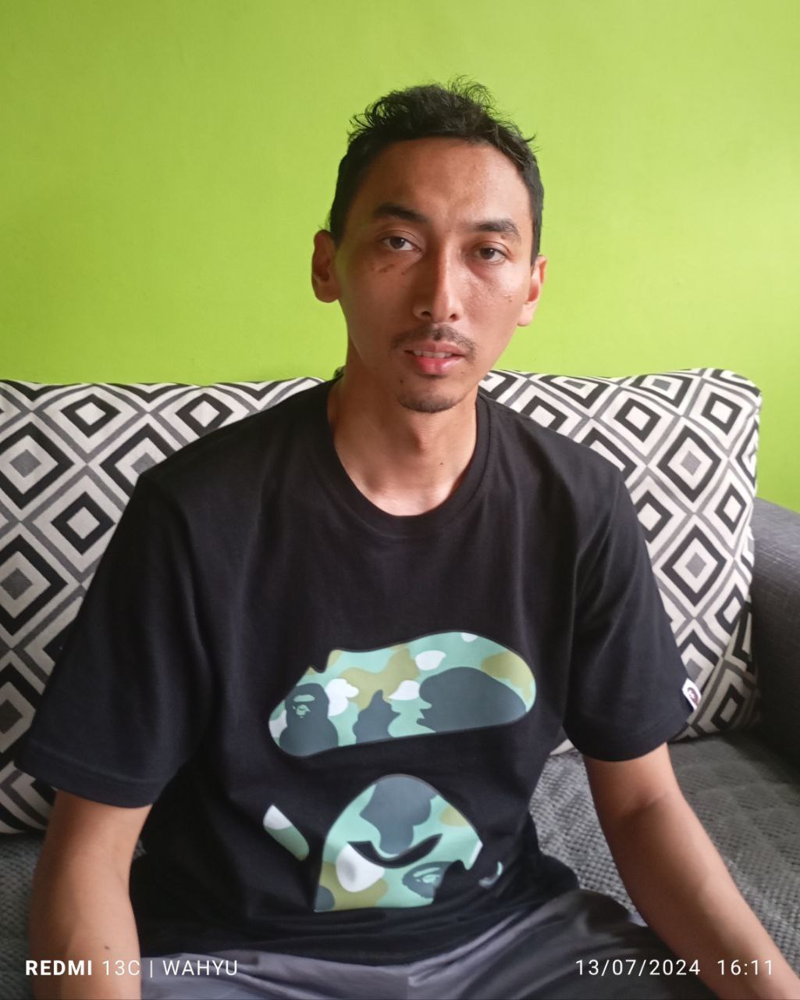
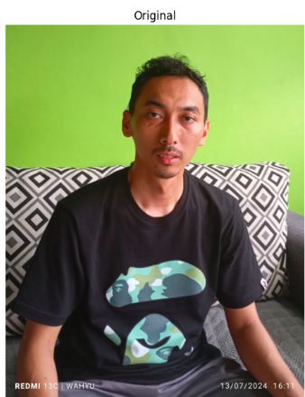
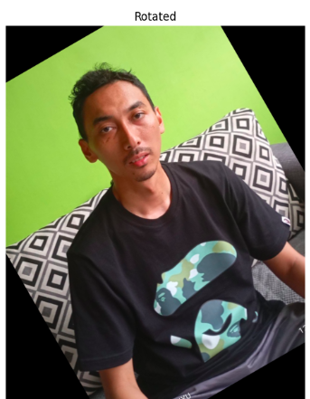
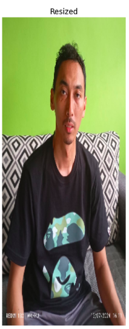
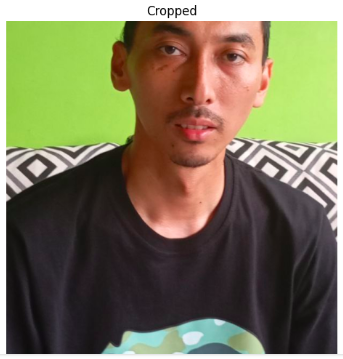
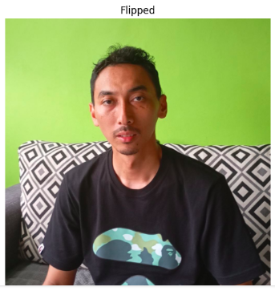
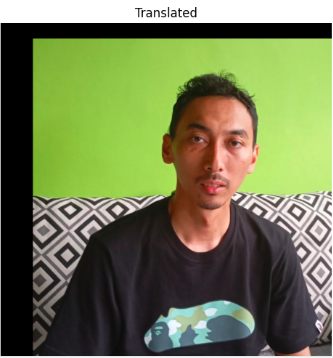

# PA-PC_202231506_WahyuJanuarAlfian_E
Penjelasan Project Akhir (UAS) Pengolahan Citra Digital
# 1. Fungsi untuk Menampilkan Gambar
## Penjelasan Dari Menampilkan gambar:
    def show_images(images, titles):
        plt.figure(figsize=(20, 20))
        for i in range(len(images)):
            plt.subplot(2, 3, i+1)
            plt.imshow(cv2.cvtColor(images[i], cv2.COLOR_BGR2RGB))
            plt.title(titles[i])
            plt.axis('off')
        plt.show()

- Parameter:
1. images : Daftar gambar yang akan ditampilkan.
2. titles : Daftar judul untuk setiap gambar.

- Tujuan: Fungsi ini bertujuan untuk menampilkan beberapa gambar dalam satu figure menggunakan Matplotlib.
- Proses:
1. Mengatur ukuran figure menjadi 20x20.
2. Menggunakan subplot untuk mengatur tata letak gambar dalam grid 2x3.
3. Mengubah format gambar dari BGR (format default OpenCV) ke RGB agar warna ditampilkan dengan benar.
4. Menampilkan setiap gambar dengan judul masing-masing dan tanpa sumbu.

# 2. Membaca Gambar:
- Penjelasan:

image = cv2.imread('wahyu.jpg')

- Tujuan: Membaca gambar dari file wahyu.jpg ke dalam variabel image .
- Library yang Digunakan: OpenCV ( cv2 ).

# 3. Menyimpan Citra Asli:
- Penjelasan:

original = image.copy()

- Tujuan: Membuat salinan dari gambar asli dan menyimpannya ke dalam variabel original .

# 4. Rotasi Gambar:
- Penjelasan:

(h, w) = original.shape[:2]
center = (w // 2, h // 2)
matrix = cv2.getRotationMatrix2D(center, 30, 1.0)
rotated = cv2.warpAffine(original, matrix, (w, h))

- Tujuan: Memutar gambar sebesar 30 derajat.
- Proses:
1. Mendapatkan dimensi gambar (tinggi dan lebar).
2. Menentukan titik pusat rotasi.
3. Membuat matriks rotasi menggunakan cv2.getRotationMatrix2D 
4. Menerapkan transformasi rotasi pada gambar menggunakan cv2.warpAffine .

# 5. Mengubah Ukuran Gambar:
Penjelasan:

resized = cv2.resize(original, (int(w * 0.2), int(h * 0.4)))

- Tujuan: Mengubah ukuran gambar menjadi 20% dari lebar asli dan 40% dari tinggi asli.
- Proses: Menggunakan cv2.resize untuk mengubah ukuran gambar.

# 6. Memotong Gambar:
Penjelasan:

cropped = original[int(h * 0.20):int(h * 0.80), int(w * 0.20):int(w * 0.80)]

- Tujuan: Memotong bagian tengah gambar.• Proses: Menggunakan slicing untuk mengambil bagian gambar dari 20% hingga 80% dari tinggi dan lebar asli.

# 7. Membalik Gambar:
Penjelasan Kodingan:

flipped = cv2.flip(original, 1)
- Tujuan: Membalik gambar secara horizontal.
- Proses: Menggunakan cv2.flip dengan parameter 1 untuk flip horizontal.

# 8. Mentranslasi Gambar:
Penjelasan Kodingan:

tx, ty = 100, 50 # Translation distances
translation_matrix = np.float32([[1, 0, tx], [0, 1, ty]])
translated = cv2.warpAffine(original, translation_matrix, (w, h))

- Tujuan: Mentranslasi (menggeser) gambar.
- Proses:
1. Menentukan jarak translasi dalam arah x ( tx ) dan y ( ty ).
2. Membuat matriks translasi.
3. Menerapkan transformasi translasi menggunakan cv2.warpAffine.

# 9. Menampilkan Semua Gambar:
Penjelasan Kodingan:

images = [original, rotated, resized, cropped, flipped, translated]
titles = ['Original', 'Rotated', 'Resized', 'Cropped', 'Flipped', 'Translated']
show_images(images, titles)

- Tujuan: Menyimpan semua gambar yang telah dimodifikasi ke dalam daftar images dan memberikan judul yang sesuai pada daftar titles .
- Proses: Memanggil fungsi show_images untuk menampilkan gambar-gambar tersebut dengan
judul masing-masing.

